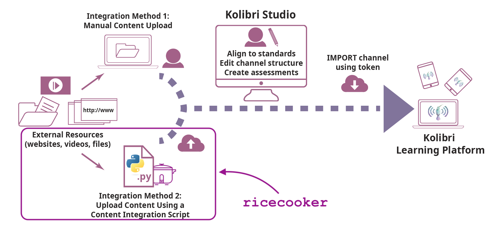

ricecooker
==========

 

The `ricecooker` library is a framework for automating the conversion of educational content into
Kolibri content channels and uploading them to [Kolibri Studio](https://studio.learningequality.org/), 
which is the central content server for [Kolibri](http://learningequality.org/kolibri/).

## [📚 Ricecooker docs](https://ricecooker.readthedocs.io/)

Visit the documentation site at [📚 ricecooker.readthedocs.io](https://ricecooker.readthedocs.io/)
for the full details about [installation](https://ricecooker.readthedocs.io/en/latest/installation.html),
[getting started](https://ricecooker.readthedocs.io/en/latest/tutorial/gettingstarted.html),
[API reference](https://ricecooker.readthedocs.io/en/latest/index_api_reference.html),
and [code examples](https://ricecooker.readthedocs.io/en/latest/examples/index.html).

## Overview of Kolibri content

`ricecooker` is used to take openly licensed educational content available on the
web and convert it into an offline-friendly package that can be imported into Kolibri.

The basic process of getting new content into Kolibri is as follows:

 - **UPLOAD** your content to Kolibri Studio either manually through the Kolibri Studio
   web interface or programmatically using a `ricecooker`-based content integration script.
 - **PUBLISH** the channel on Kolibri Studio to make it accessible for use in Kolibri.
 - **IMPORT** the the channel into Kolibri using the channel token displayed in
   Kolibri Studio after the PUBLISH step is done.

The diagram below illustrates how content flows within the Kolibri ecosystem
and highlights the part which is covered by the `ricecooker` framework (bottom left).

  
*External content sources (left) are first uploaded to [Kolibri Studio](https://studio.learningequality.org/) (middle), so they can be used in the [Kolibri Learning Platform](http://learningequality.org/kolibri/) (right).*

##### Further reading
The [Ricecooker docs](https://ricecooker.readthedocs.io/) website is the best
place to learn about writing automated content integration scripts.

Here are some links to other documents and guides you can read to learn about
the other parts of the Kolibri content platform:
  
  - The [Kolibri Content Integration Guide](https://learningequality.org/r/integration-guide)
    is a comprehensive guide to the decisions, processes, and tools for integrating
    external content sources for use in the Kolibri Learning Platform.
  - Read the [Kolibri Studio docs](http://kolibri-studio.readthedocs.io/en/latest/)
    to learn more about the Kolibri Studio features
  - Read the [Kolibri docs](http://kolibri.readthedocs.io/en/latest/) to learn
    how to install Kolibri on your machine (useful for testing channels)
