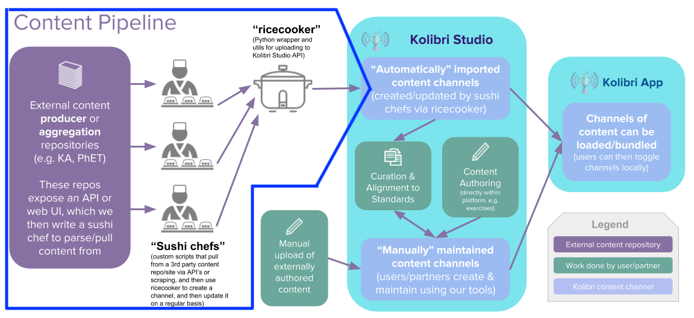

=============================================
ricecooker: Kolibri Content Integration Tools
=============================================

The Kolibri channels used by `Kolibri <https://learningequality.org/kolibri/>`_
are created using `Kolibri Studio <https://studio.learningequality.org/>`_, which
is a central content repository, an online channel editor, and the home of the Kolibri Content Library.
Using ``ricecooker`` you can convert existing educational content (documents, audios, videos, HTML apps, etc.)
into Kolibri channels ready to be uploaded to Kolibri Studio and used offline in Kolibri.

The basic process of getting new content into Kolibri is as follows:

 * **UPLOAD** your content to Kolibri Studio using one of two methods:
   (1) manually uploading through the `Kolibri Studio web interface <https://kolibri-studio.readthedocs.io/en/latest/working_channels.html#create-a-new-channel>`_,
   or (2) using a content integration script based on the ``ricecooker`` framework.
 * `PUBLISH <https://kolibri-studio.readthedocs.io/en/latest/publish_channel.html>`__
   the channel on Kolibri Studio to make it accessible for use in Kolibri.
 * `IMPORT <https://kolibri.readthedocs.io/en/latest/manage/resources.html#import-with-token>`__
   the channel into Kolibri using the channel token displayed in Kolibri Studio after the PUBLISH step is done.

   **Content flow within the Kolibri ecosystem.**
   External content sources (left) are first uploaded to `Kolibri Studio <https://studio.learningequality.org/>`__ (middle)
   so they can be imported into the `Kolibri Learning Platform  <https://learningequality.org/kolibri/>`__ (right).

.. toctree::
   :hidden:

   installation
   tutorial/index
   concepts/index
   examples/index
   index_api_reference
   index_utils
   developer/index
   community/index

Non-technical documentation redirects
-------------------------------------
The ``ricecooker`` docs are mainly a *technical* documentation project intended
for readers with prior experience with programming and running command line scripts.
If you're not a tech person, no worries. You can do everything that ``ricecooker``
scripts can do through the `Kolibri Studio <https://studio.learningequality.org/>`_ web interface.
We redirect you to the `channel create <https://kolibri-studio.readthedocs.io/en/latest/working_channels.html#create-a-new-channel>`_
and `add your content <https://kolibri-studio.readthedocs.io/en/latest/add_content.html>`_
info in the Kolibri Studio docs.

We recommend reading the `Kolibri Content Integration Guide <https://learningequality.org/r/integration-guide>`_
which is a comprehensive guide to the decisions, processes, and tools for integrating
external content sources for use in the Kolibri Learning Platform.

Technical documentation
-----------------------
If you're still reading this, we'll **assume you've got access to the internet**,
and some **prior experience with Python**, in which case the technical documentation is for you.

.. rst-class:: clearfix row

.. rst-class:: firstcolumn column2

`Install <installation.html>`__
*******************************
Guide to installing the ``ricecooker`` package and system dependencies on
`Linux <installation.html#linux>`_, `Mac <installation.html#mac>`_,
and `Windows <installation.html#windows>`_.

.. rst-class:: lastcolumn column2

`Getting started <tutorial/gettingstarted.html>`__
**************************************************
A step-by-step guide to writing your first content integration script
based on the Ricecooker framework including sample code.

.. rst-class:: clearfix row

--------------------------------------------------------------------------------

.. rst-class:: clearfix row

Intermediate topics
-------------------
Once you've completed the *Getting started* steps, you can read the following pages
to take your ``ricecooker`` game to the next level.

.. rst-class:: clearfix row

.. rst-class:: firstcolumn column3

`Ricecooker API reference <index_api_reference.html>`__
*******************************************************
Discover the kinds of `content nodes <nodes.html>`_ like
`HTML5App <htmlapps.html>`_, video, audio, document,
and `exercises <exercises.html>`_ nodes you can use to build Kolibri channels.

.. rst-class:: column column3

`HTML5 Apps <htmlapps.html>`__
******************************
Learn how to scrape websites, `parse HTML <parsing_html.html>`_,
and `debug <developer/kolibripreview.html>`_ the `HTML5 App <htmlapps.html>`_ nodes.

.. rst-class:: lastcolumn column3

`Concepts and workflow <concepts/index.html>`__
***********************************************
Understand the main concepts, `terminology <concepts/terminology.html>`__,
and `workflows <concepts/content_workflows.html>`__
for creating Kolibri channels,
as well as the `review <concepts/reviewing_channels.html>`__ process.

.. rst-class:: clearfix row

--------------------------------------------------------------------------------

.. rst-class:: clearfix row

Advanced topics
---------------
Developing your Python `automation superpowers <https://xkcd.com/353/>`__,
requires mastering lots of different techniques specific for different kinds of content sources.
Use the links below to jump to the specific topics that you want to learn about.

.. rst-class:: firstcolumn column3

`Command line interface <chefops.html#ricecooker-cli>`_
*******************************************************
Use command line options like ``--thumbnails`` (auto-generating thumbnails),
and ``--compress`` (video compression) to create better channels.

.. rst-class:: column column3

`Utility functions <index_utils.html>`_
***************************************
Learn what tools are available for:
`downloading <downloader.html>`__,
`creating <htmlapps.html>`__ and `debugging <developer/kolibripreview.html>`__ HTMLZip files,
`video compression <video_compression.html>`__,
`splitting PDFs <pdfutils.html>`__ into chapters,
and the `CSV metadata workflow <csv_metadata/csv_workflow.html>`__.

.. rst-class:: lastcolumn column3

`Developer docs <developer/index.html>`_
*****************************************
Explanations about how the ``ricecooker`` works in full details,
including the `computed ids <developer/ids.html>`__,
the `upload process <developer/uploadprocess.html>`__,
and `bulk corrections <developer/corrections.html>`__ scripts.
