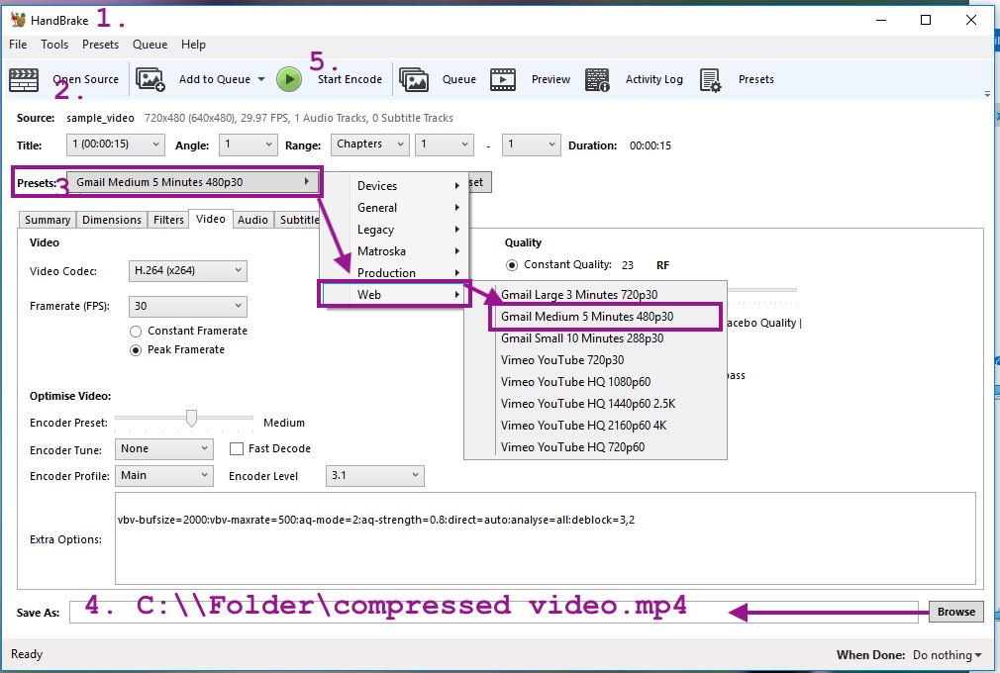

Video compression tools
=======================

Importing video files into Kolibri requires special considerations about the file
size of the video resources that will be imported.

Below are some general guidelines for importing video files:
  - Use the `.mp4` file format
  - Use the `H.264` (a.k.a. `x264`) video codec to ensure video will play in web browsers
  - Use the `aac` audio codec
  - Use compression
    - Short videos (5-10 mins long) should be roughly less than 15MB
    - Longer video lectures (1 hour long) should not be larger than 200MB
    - High-resolution videos should be converted to lower resolution formats:
      Here are some recommended choices for video vertical resolution:
       - Use max height of `480` for videos that work well in low resolution (most videos)
       - Use max height of `720` for high resolution videos (lectures with writing on board)

Using video compression and low resolutions is important for the context of use.
**Think of the learners and the device they will be using to view the videos.**
Consider also the overall size of the channel---**how much storage space** will be
required for the entire collection of videos?

Let's now look at compression tools that you can use to ensure a good video
experience for all Kolibri users, regardless of their device.

Automated conversion
--------------------
The `ricecooker` library can handle the video compression for you if you specify
the `--compress` command line argument to the chef script, e.g. `python chef.py ... --compress`.
Under the hood, the `ffmpeg` video conversion program will be called to compress
video files before uploading them to Kolibri Studio. Specifying `--compress` on
the command line will use the following default settings:

    ffmpeg -i inputfile.mp4 \
      -b:a 32k -ac 1 \
      -vf scale="'w=-2:h=trunc(min(ih,480)/2)*2'" \
      -crf 32 \
      -profile:v baseline -level 3.0 -preset slow -v error -strict -2 -stats \
      -y outputfile.mp4

This command takes the `inputfile.mp4` and outputs the file `outputfile.mp4` that
has the following transformations applied to it:
  - Limits the audio codec to 32k/sec
  - Scale the video to max-height of 480 pixels
  - Compress the video with CRF of 32 (constant rate factor)

To overwrite these defaults, chef authors can pass the argument `ffmpeg_settings` (dict),
when creating `VideoFile` object, and specify these options: `crf`, `max_height`, and `max_width`.

Manual conversion
-----------------
For optimal control of the compression options, users should perform the conversion
and compression steps before uploading their videos to Kolibri Studio.
We highly recommend the command line tool [`ffmpeg`](https://www.ffmpeg.org/).
You'll need to use it through the command prompt (Terminal in linux, CMD in Windows).
Any video conversion and compression operation can be performed by setting the
appropriate parameters.

### Installing ffmpeg
Before proceeding, please go and download the `ffmpeg` program for you OS:

Links:
  - Homepage: https://www.ffmpeg.org/
  - Downloads for windows users: https://web.archive.org/web/20200918193047/https://ffmpeg.zeranoe.com/builds/
    Choose 64bit "static" version to download, unzip the archive, then go to the folder
    called `bin/` inside the zip file. Copy the files `ffmpeg.exe` and `ffprobe.exe`
    to the folder on your computer where your videos are stored.

To check the installation was successful you can open a command line prompt
([cmd.exe on Windows](https://www.howtogeek.com/wp-content/uploads/2017/02/Windows_106-650x300.jpg),
or terminal on mac/linux), and try typing in the command:

    ffmpeg -h

which will print command help information. You can see the full list command line
options for `ffmpeg` here: [https://www.ffmpeg.org/ffmpeg.html](https://www.ffmpeg.org/ffmpeg.html).
Don't worry you won't need to use all of them.

If you see the error message "ffmpeg is not recognized as an internal or external command,
operable program or batch file,"  you will have to change directory to the folder where you
saved the program files `ffmpeg.exe` and `ffprobe.exe`  (e.g. use `cd Desktop` if saved
on the desktop or `cd %HOMEPATH%\Documents` to go to your Documents folder).

### Looking around with ffprobe
Equally useful is the command `ffprobe` which prints detailed information for
any video files. To illustrate the usefulness, let's see what info `ffprobe`
can tells us about some video files downloaded from the internet. You can download
the same files from [here](https://archive.org/details/CM_National_Rice_Cooker_1982)
if you want to follow along (download the three different video formats available
in the sidebar: `ogv`, `mpg`, and `mp4`)

To check what's in the file `CM_National_Rice_Cooker_1982.ogv` use the command:

    ffprobe  CM_National_Rice_Cooker_1982.ogv

    Input #0, ogg, from 'CM_National_Rice_Cooker_1982.ogv':
      Duration: 00:00:15.03, start: 0.000000, bitrate: 615 kb/s
        Stream #0:0: Video: theora, yuv420p,
                     400x300 [SAR 1:1 DAR 4:3], 29.97 fps, 29.97 tbr, 29.97 tbn, 29.97 tbc
        Stream #0:1: Audio: vorbis, 44100 Hz, stereo, fltp, 128 kb/s

The video codec is `theora` and the audio codec is `vorbis`, so this video will
need to be converted before uploading to Studio.

Similarly we can check the codecs for `CM_National_Rice_Cooker_1982.mpg` using

    ffprobe  CM_National_Rice_Cooker_1982.mpg

    Input #0, mpeg, from 'CM_National_Rice_Cooker_1982.mpg':
    Duration: 00:00:15.02, start: 0.233367, bitrate: 6308 kb/s
      Stream #0:0[0x1e0]: Video: mpeg2video (Main), yuv420p(tv, smpte170m, top first),
                          720x480 [SAR 8:9 DAR 4:3], 29.97 fps, 29.97 tbr, 90k tbn, 59.94 tbc
      Stream #0:1[0x1c0]: Audio: mp2, 48000 Hz, stereo, s16p, 224 kb/s

The video codec is `mpeg2video` and the audio codec is `mp2`, so this video too
will need to be converted.

Finally, to check the codecs for `CM_National_Rice_Cooker_1982.mp4`, we use

    ffprobe  CM_National_Rice_Cooker_1982.mp4

    Input #0, mov,mp4,m4a,3gp,3g2,mj2, from 'CM_National_Rice_Cooker_1982.mp4':
      Duration: 00:00:15.05, start: -0.012585, bitrate: 835 kb/s
        Stream #0:0(und): Video: h264 (Constrained Baseline) (avc1 / 0x31637661), yuv420p,
                          640x480 [SAR 1:1 DAR 4:3], 700 kb/s, 29.97 fps, 29.97 tbr, 30k tbn, 59.94 tbc (default)
        Stream #0:1(und): Audio: aac (LC) (mp4a / 0x6134706D), 44100 Hz, stereo, fltp, 129 kb/s (default)

Here we see the `h264` video codec  and `aac/mp4a` audio codec so this file can
be uploaded to Studio as is. These codecs are relatively well supported by
[most browsers](https://developer.mozilla.org/en-US/docs/Web/Media/Formats).
This video can be uploaded to Kolibri.

### Converting files using ffmpeg

Recall the file `CM_National_Rice_Cooker_1982.mpg` that we downloaded above,
which uses the Kolibri-incompatibe codecs `mpeg2video` and `mp2`.
Let's see how to use the `ffmpeg` command to convert it to the supported codecs:

    ffmpeg -i CM_National_Rice_Cooker_1982.mpg \
      -b:a 32k -ac 1 \
      -vf scale="'w=-2:h=trunc(min(ih,480)/2)*2'" \
      -crf 32 \
      -profile:v baseline -level 3.0 -preset slow -v error -strict -2 -stats \
      -y compressed.mp4

Note the `\` character denotes line-continuation and works only on UNIX.
Windows users should put the entire command on a single line:

    ffmpeg -i CM_National_Rice_Cooker_1982.mpg   -b:a 32k -ac 1   -vf scale="'w=-2:h=trunc(min(ih,480)/2)*2'"   -crf 32   -profile:v baseline -level 3.0 -preset slow -v error -strict -2 -stats   -y compressed.mp4

This command will run for some time (video transcoding takes a lot of CPU power).
In the end, if you check using `ffprobe  compressed.mp4`, you'll see that the
converted output file has video codec `h264` and audio codec `aac`.
The resolution `720x480` and  bitrate `534 kb/s` are also very good parameters.
Note the file size of `compressed.mp4` is 1MB which is twice smaller than the
file `mp4` file which we obtained directly form the web `CM_National_Rice_Cooker_1982.mp4`.
Clearly the compression option `-crf 32` had an effect.

The video `compressed.mp4` is now ready for upload to Studio!

### Using the ffmpeg helper scripts

We provide a helper script to help run the ffmpeg command. The instructions are different
depending if your operating systems is Windows or Mac/Linux:

  - For Windows users, download the file [convertvideo.bat](https://raw.githubusercontent.com/learningequality/ricecooker/master/resources/scripts/convertvideo.bat)
    and save it to your computer. Make sure the extension is `.bat` (Windows batch file).
    Put the `convertvideo.bat` file in the same folder where you copied `ffmpeg.exe`.
    To convert `inputfile.mp4` to `outputfile.mp4` using the conversion script, open a
    command line prompt, navigate to the folder where `convertvideo.bat` and `ffmpeg.exe`
    are stored, and type the following command:

        convertvideo.bat  inputfile.mp4  outputfile.mp4

  - Linux and Mac users should download [convertvideo.sh](https://raw.githubusercontent.com/learningequality/ricecooker/master/resources/scripts/convertvideo.sh),
    save it to the folder where all the videos are. Next open a command prompt and change
    directory to that folder. Make the script executable using `chmod u+x convertvideo.sh`,
    then you can start converting videos using:

        ./convertvideo.sh  inputfile.mp4  outputfile.mp4

See [https://youtu.be/oKbCbuDlRmY](https://www.youtube.com/watch?v=oKbCbuDlRmY)
for a video walkthrough of the steps and example usage of the batch script.

<iframe width="560" height="315" src="https://www.youtube.com/embed/oKbCbuDlRmY" frameborder="0" allow="accelerometer; autoplay; encrypted-media; gyroscope; picture-in-picture" allowfullscreen></iframe>

&nbsp;

The conversion scripts provided are just wrappers for the `ffmpeg` command, to make it
easier for you so you won't have to remember all the command line options. If you need
to adjust the conversion parameters, you edit the scripts---they are ordinary text files,
so you can edit them with notepad.

Note video conversion takes a long time, so be prepared to get a coffee or two.

### HandBrake
If you don't have many videos to convert, you can use [HandBrake](https://handbrake.fr/),
which is a video conversion tool with a graphical user interface. Handbrake uses
`ffmpeg` under the hood, so the same compression results can be achieved as with
the more technical options presented above.

Here are steps for converting videos using HandBrake:

  1. **Download** and install handbrake from here [https://handbrake.fr/](https://handbrake.fr/)
  2. **Open** the video file you want to compress.
  3. From the presets menu, choose **Web > Gmail Medium 5 Minutes 480p30**
  4. Set the output filename (e.g. you could use the same as input filename,
     but append `_compressed.mp4`). Make sure to use the `.mp4` extension.
  5. Click the **Start Encode** button.

Here is a [video guide to using HandBrake](https://www.youtube.com/watch?v=83MdDLaFXfs) for compressing videos.

<iframe width="560" height="315" src="https://www.youtube.com/embed/83MdDLaFXfs" frameborder="0" allow="accelerometer; autoplay; encrypted-media; gyroscope; picture-in-picture" allowfullscreen></iframe>

&nbsp;

The **Web > Gmail Medium 5 Minutes 480p30** preset will use the `x264` video codec,
`aac` audio codec, and `480` vertical resolution, and compression rate `crf=23`.
The 480 vertical resolution is a good choice for most videos, but if you find the compressed output to be too low quality, you can try the preset
**Web > Gmail Large 3 Minutes 720p30**, which will result in larger videos files
with 720 vertical resolution.

If your channel contains many videos, or very long videos, you should consider
increasing the "Constant Rate Factor" compression parameter in the Video settings.
Using the value [RF=32](https://github.com/learningequality/ricecooker/blob/master/docs/figures/HandBrake/handbreake_screenshot_video_settings.png)
will result in highly compressed videos, with very small file sizes.

### Experimenting
Since every content source is unique, we recommend that you experiment with
different compression options. The command line tool `ffmpeg` offers a very
useful option called `crf` which stands for Constant Rate Factor.
**Setting this single parameter allows for controlling overall video quality.**
For example, setting `crf=24` produces high quality video (and possibly large file size),
`crf=28` is a mid-range quality, and values of `crf` above 30 produce highly-compressed
videos with small size.

Here are the steps to preview different compression factors in Kolibri:
  - Choose a sample video from your collection, let's call it `video.mp4`
  - Try different compression options for it:
    - Create a CRF=24 version using `ffmpeg -i video.mp4 ... -crf 24 video_crf24.mp4`
    - Create a CRF=28 version using `ffmpeg -i video.mp4 ... -crf 28 video_crf28.mp4`
    - Create a CRF=30 version using `ffmpeg -i video.mp4 ... -crf 30 video_crf30.mp4`
  - Upload the original and the compressed version to a Studio channel
  - PUBLISH the channel and record the channel token
  - Import the channel into a Kolibri instance using the channel token
  - Test video playback on different devices (desktop and mobile browsers on all OSs)

